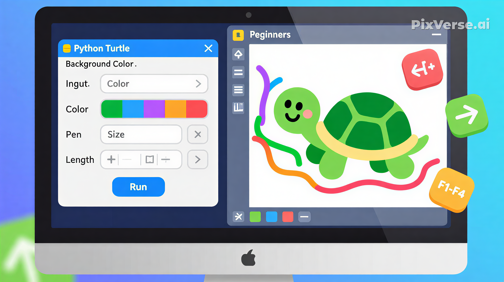

# Go-Turtle 🐢

**Python Turtle Graphics Application with Customizable Settings**

A keyboard-controlled turtle graphics application built with Python's `turtle` module and `tkinter` for customizable settings.

## 🖼️ Cover

<p align="center">
  
</p>

## ✨ Features

- 🎨 **Customizable Settings**: Configure background color, pen color, pen size, and movement length
- ⌨️ **Keyboard Control**: Use arrow keys to control turtle movement
- ⚙️ **Pen Controls**: Toggle pen up/down, clear screen, and undo actions
- 🖌️ **Visual Customization**: Real-time preview of drawing with your chosen settings
- 🚀 **Easy Setup**: Simple configuration before starting to draw

## 🚀 Installation

### Prerequisites
- Python 3.6 or higher
- tkinter (usually included with Python installation)

### Setup

1. Clone the repository:
```bash
git clone https://github.com/PyRezaSeyyednezhad/Go-Turtle.git
cd Go-Turtle
```

2. Install requirements (if any):
```bash
# No additional packages required for basic functionality
```

3. Run the application:
```bash
python main.py
```

## 🎮 Usage

### 1. Configuration Screen
When you start the application, you'll see a settings window:

**Available Settings:**
- **Background Color**: Enter hex color (e.g., `#000000` for black)
- **Pen Color**: Enter hex color (e.g., `#FFFFFF` for white)
- **Font Size/Pen Size**: Enter number 1-20
- **Move Length**: Enter number 1-100 (pixels per movement)

**Default Values (if left empty):**
- Background: Black (`#000000`)
- Pen Color: White (`#FFFFFF`)
- Pen Size: 5
- Move Length: 50 pixels

### 2. Turtle Control Window
After clicking "Run", the turtle graphics window opens:

**Keyboard Controls:**
| Key | Action |
|-----|--------|
| **↑** (Up Arrow) | Move turtle upward |
| **↓** (Down Arrow) | Move turtle downward |
| **→** (Right Arrow) | Move turtle right |
| **←** (Left Arrow) | Move turtle left |
| **F1** | Pen Up (stop drawing) |
| **F2** | Pen Down (start drawing) |
| **F3** | Clear screen |
| **F4** | Undo last action |

## 📁 Project Structure

```
Go-Turtle/
├── main.py              # Main application file
├── README.md            # Documentation
└── .gitignore          # Git ignore patterns
```

## 💻 Code Overview

The application consists of two main components:

### 1. Settings Window (`tkinter`)
- Creates a configuration interface
- Validates user input
- Sets default values if inputs are empty
- Launches the turtle graphics window

### 2. Turtle Graphics Window (`turtle`)
- Interactive drawing canvas
- Keyboard event listeners for control
- Real-time drawing with custom settings

## 🔧 Customization

### Default Settings
You can modify the default values in the `config()` function:

```python
# Current defaults:
tl.bgcolor("#000")      # Background color
tl.color("#fff")        # Pen color
tl.pensize(5)           # Pen thickness
MOVE_LENGTH = 50        # Movement distance
```

### Adding New Features
To add new keyboard controls:

```python
def new_action():
    # Your action here
    pass

tl.onkeypress(new_action, 'KeyName')  # e.g., 'a', 'space', etc.
```

## 🤝 Contributing

Contributions are welcome! Here are some ways to contribute:

### Feature Ideas:
1. **Save/Load Drawings**: Add functionality to save drawings as images
2. **More Shapes**: Predefined shape buttons (circle, square, etc.)
3. **Color Palette**: Visual color picker instead of hex codes
4. **Grid System**: Toggle grid for precise drawing
5. **Shape Fill**: Add fill color options
6. **Animation**: Record and replay drawing sequences

### How to Contribute:
1. Fork the repository
2. Create a feature branch: `git checkout -b feature/NewFeature`
3. Commit changes: `git commit -m 'Add NewFeature'`
4. Push to branch: `git push origin feature/NewFeature`
5. Open a Pull Request

## 🐛 Troubleshooting

### Common Issues:

1. **ModuleNotFoundError: No module named 'tkinter'**
   ```bash
   # On Ubuntu/Debian:
   sudo apt-get install python3-tk
   
   # On macOS with Homebrew:
   brew install python-tk
   
   # On Windows: Usually included by default
   ```

2. **Window doesn't respond to keyboard**
   - Ensure the turtle window is active (click on it)
   - Some systems may require focus on the turtle window

3. **Colors not working**
   - Use proper hex format: `#RRGGBB`
   - Ensure hash symbol (`#`) is included
   - Valid example: `#FF5733`

## 🙏 Acknowledgments

- Built with Python's built-in `turtle` graphics module
- Uses `tkinter` for the settings interface

## 📞 Support

For issues, questions, or suggestions:
- Open an [Issue](https://github.com/PyRezaSeyyednezhad/Go-Turtle/issues)
- Provide details about your Python version and operating system

---

**Happy Drawing! 🎨🐢**

*Created with Python Turtle Graphics*
